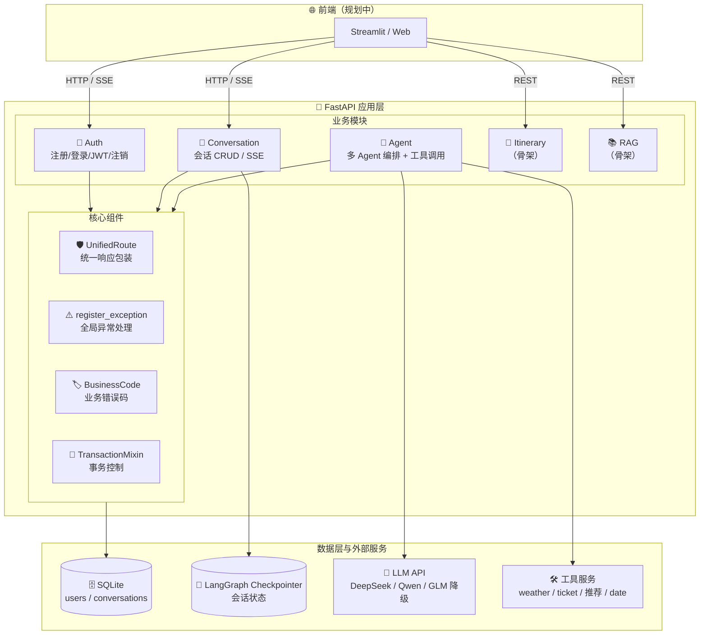
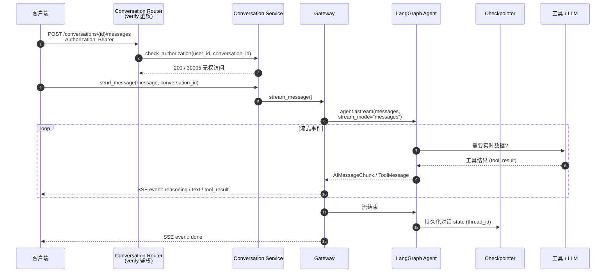
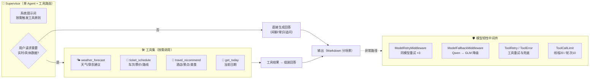
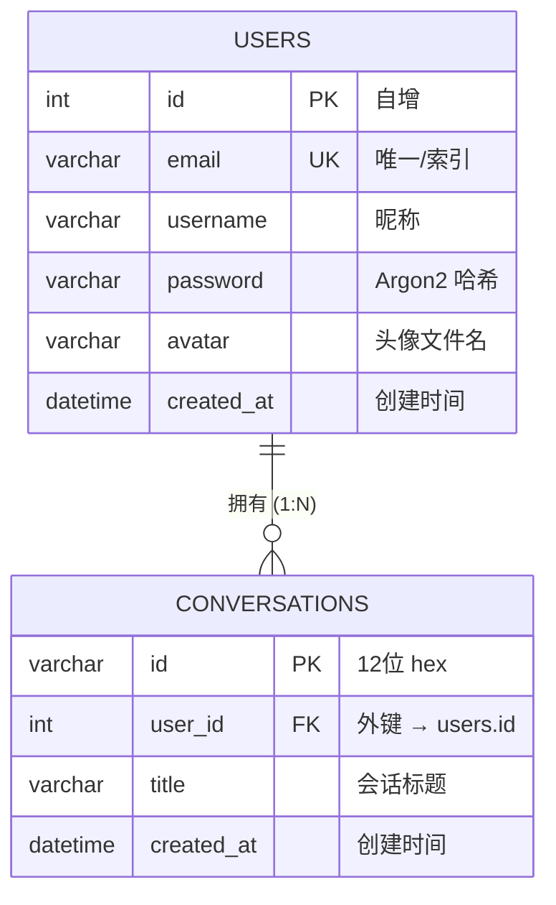
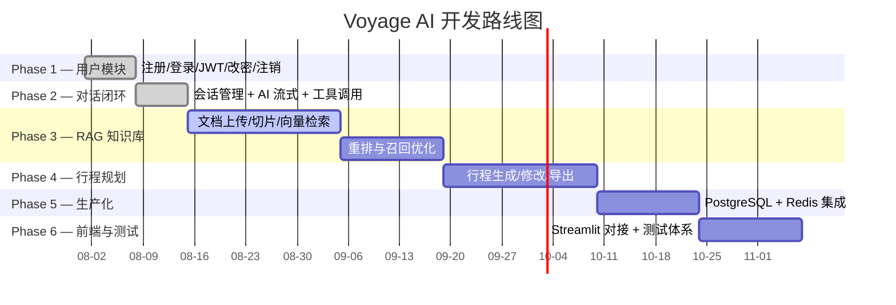

<div align="center">

# 🌏 Voyage AI — 智能旅行规划平台

**基于 FastAPI + SQLAlchemy 2.0 (Async) + LangChain/LangGraph 多 Agent 的 AI 旅行规划后端**

[](https://www.python.org/)
[](https://fastapi.tiangolo.com/)
[](https://www.sqlalchemy.org/)
[](https://www.langchain.com/)
[]()

**当前版本：`v0.1.0`（MVP 阶段）**

</div>

---

## 📌 项目简介

Voyage AI 定位为「旅行专家 + 生活闲聊伙伴」的 AI 助手后端。核心能力：用户体系（**注册 / 登录 / 资料管理 / 注销**）、会话管理（**创建 / 删除 / 历史消息**）、基于 **LangGraph 多 Agent** 的流式对话（支持天气、车次票价、行程推荐等工具**按需调用**），并通过 **Checkpointer** 持久化每个会话的对话状态。当前已完成**用户模块与对话闭环**，行程规划与 RAG 知识库处于规划 / 未开始阶段。

---

## 🏗️ 系统架构（Mermaid）



**技术组件标注**：`JWT 鉴权（Auth）` · `SSE 流式响应（Conversation）` · `多 Agent + 工具调用（Agent）` · `Checkpointer 状态持久化` · `UnifiedRoute 统一响应` · `BusinessCode 业务错误码` · `TransactionMixin 事务`。

---

## ✨ 功能开发进度

> 标记规则：✅ 已实现且稳定 ｜ 🔄 半实现 / 有已知限制 ｜ ⬜ 未实现

### 👤 用户模块（Auth）

| 功能 | 状态 |
|------|------|
| ✅ 用户注册（邮箱 + 密码 + Argon2 哈希） | ✅ 稳定 |
| ✅ 密码强度校验（≥8 位 + 大小写字母 + 数字；注册与改密均生效） | ✅ 稳定 |
| ✅ 用户登录（Argon2 校验 + JWT access token 签发） | ✅ 稳定 |
| ✅ JWT 鉴权依赖（`get_current_user`，请求级校验 token 与用户存在性） | ✅ 稳定 |
| ✅ 获取当前用户信息 / 修改资料（昵称、头像短名） | ✅ 稳定 |
| ✅ 修改密码（验证当前密码 + 新旧不相同 + 新密码强度） | ✅ 稳定 |
| ✅ 用户注销（硬删除：先清会话 checkpoint，再删用户并级联删会话） | ✅ 稳定 |
| ✅ 可选头像库（固定头像 + CDN 前缀，公开接口） | ✅ 稳定 |
| 🔄 Refresh Token（已签发，未接入 Redis、无刷新端点） | 🔄 半实现 |
| ⬜ 邮箱验证码 / 密码重置 | ⬜ 未实现 |
| ⬜ 软删除 + 注销冷却期反悔机制（需 Redis 定时扫描） | ⬜ 未实现 |

### 💬 会话模块（Conversation）

| 功能 | 状态 |
|------|------|
| ✅ 会话创建（绑定 user_id，12 位 hex 短 ID 主键） | ✅ 稳定 |
| ✅ 会话列表（按当前用户查询） | ✅ 稳定 |
| ✅ 会话历史消息查询（从 Checkpointer 读取 LangGraph state） | ✅ 稳定 |
| ✅ 会话删除（先清 checkpoint 再删业务行，事务控制） | ✅ 稳定 |
| ✅ 会话鉴权（校验会话存在性 + 归属当前用户） | ✅ 稳定 |
| ✅ 批量删除会话 checkpoint（`delete_conversation_batch`，`asyncio.gather` 并发） | ✅ 稳定 |
| 🔄 checkpoint 与业务库双删的失败补偿 / 日志记录 | 🔄 半实现 |

### 🤖 AI 对话模块（Agent）

| 功能 | 状态 |
|------|------|
| ✅ SSE 流式响应（`stream_mode="messages"`，分帧推送） | ✅ 稳定 |
| ✅ 多 Agent 编排（Supervisor 决策 + 工具按需触发） | ✅ 稳定 |
| ✅ 工具调用（天气、车次/票价、行程推荐、日期） | ✅ 稳定 |
| ✅ 模型韧性（同模型重试 + 多模型降级 + 工具重试与错误兜底） | ✅ 稳定 |
| ✅ 工具调用限流（线程 / 轮次上限） | ✅ 稳定 |
| ✅ 聊天状态持久化（Checkpointer：SQLite 默认，Redis 版实验分支） | ✅ 可用 |
| 🔄 上下文压缩 / 长会话管理（中间件注释待启用） | 🔄 半实现 |
| 🔄 工具调用失败的系统化日志 | 🔄 半实现 |

### 🗄️ 数据层与基础设施

| 功能 | 状态 |
|------|------|
| ✅ SQLite（aiosqlite 异步驱动）+ SQLAlchemy 2.0 Async（AsyncAttrs / 级联删除） | ✅ 稳定 |
| ✅ Alembic 迁移骨架 | ✅ 可用 |
| ✅ 统一响应包装（UnifiedRoute → `{code, message, data}`） | ✅ 稳定 |
| ✅ 业务错误码体系（BusinessCode：成功 / 通用 / 用户 / 会话 / AI / 知识库 / 行程） | ✅ 稳定 |
| ✅ 事务控制（TransactionMixin：业务异常 / 未知异常自动回滚） | ✅ 稳定 |
| 🔄 SQLite → PostgreSQL（asyncpg 依赖已配，未启用） | 🔄 规划中 |
| ⬜ Redis 集成（refresh token 存储、软删除冷却、缓存） | ⬜ 未实现 |
| ⬜ 单元 / 集成测试（pytest 骨架存在，核心路径未覆盖） | ⬜ 未实现 |

### 🧳 业务扩展模块

| 功能 | 状态 |
|------|------|
| ⬜ 行程规划（生成 / 查看 / 修改 / 导出） | ⬜ 未开始 |
| ⬜ RAG 知识库（文档上传、切片、向量检索、重排） | ⬜ 未开始 |
| ⬜ 前端对接（Streamlit 鉴权 + 会话恢复） | ⬜ 未开始 |

---

## 🔍 可视化图表（Mermaid）

### 1️⃣ AI 对话流式响应时序



### 2️⃣ Multi-Agent 协作



### 3️⃣ 数据库 ER 图



> 关系说明：`conversations.user_id` 外键 `ON DELETE CASCADE`（数据库层）+ `User.conversations` ORM 级联 `cascade="all, delete-orphan"`（应用层双保险）。规划中：`itineraries`（行程）、`knowledge`（知识库）表。

### 4️⃣ 开发路线 Gantt（Roadmap）



---

## 🧩 模块说明

| 模块 | 描述 | 状态 |
|------|------|------|
| `app/core/business` | 业务错误码（BusinessCode）、异常体系、全局异常处理 | ✅ 稳定 |
| `app/core/route` | `UnifiedRoute`：HTTP 状态码 → 业务码自动包装统一响应 | ✅ 稳定 |
| `app/core/ai` | LLM 封装、多 Agent 编排、中间件、工具集（天气/车次/推荐/日期） | ✅ 可用 |
| `app/modules/user` | 注册 / 登录 / JWT 鉴权 / 资料 / 改密 / 注销 | ✅ 稳定 |
| `app/modules/conversation` | 会话 CRUD、SSE 流式对话、Checkpointer 网关、批量删除 | ✅ 稳定 |
| `app/modules/itineraries` | 行程规划（骨架，`TODO` 占位） | ⬜ 未开始 |
| `app/modules/knowledge` | RAG 知识库（骨架，`TODO` 占位） | ⬜ 未开始 |
| `app/shared/db` | SQLAlchemy 异步引擎 / Session / ORM 模型（级联删除） | ✅ 稳定 |
| `app/shared/utils` | `TransactionMixin` 事务控制 | ✅ 稳定 |

---

## 🛠️ 技术栈

| 类别 | 技术 |
|------|------|
| Web 框架 | FastAPI · Uvicorn · fastapi-utils (CBV) |
| ORM / 数据库 | SQLAlchemy 2.0 (Async) · aiosqlite · Alembic · asyncpg（规划) |
| 认证 | Argon2（密码哈希）· python-jose（JWT）· Hashids（ID 混淆）· OAuth2PasswordBearer |
| AI / Agent | LangChain · LangGraph（多 Agent、Checkpointer、中间件） |
| 模型接入 | LangChain-OpenAI（兼容 DeepSeek / Qwen / GLM，含多模型降级） |
| 流式传输 | SSE（sse-starlette / EventSourceResponse） |
| 工具链 | LangChain 工具（天气 / 车次票价 / 行程推荐 / 日期）+ MCP 适配（预留） |
| 向量 / RAG | llama-index · Milvus / PyMilvus（依赖已装，功能未启用） |
| 缓存 / 会话 | Redis · langgraph-checkpoint-redis（依赖已装，功能未启用） |
| 工程 | uv · ruff · black · pytest（骨架） |

---

## 📁 项目目录结构

```
voyage/
├── app/
│   ├── main.py                    # FastAPI 入口：挂载路由、CORS、全局异常、lifespan
│   ├── config.py                  # 配置（JWT 密钥/过期、HASH 盐等）
│   ├── core/
│   │   ├── business/              # 业务错误码 + 异常 + 统一响应
│   │   ├── route.py               # UnifiedRoute 响应包装
│   │   └── ai/                    # LLM、多 Agent、中间件、工具
│   ├── modules/
│   │   ├── user/                  # auth / constants / dependencies / repo / router / schemas / service
│   │   ├── conversation/          # gateway / repo / router / schemas / service
│   │   ├── itineraries/           # （骨架）行程规划
│   │   └── knowledge/             # （骨架）RAG 知识库
│   └── shared/
│       ├── db/                    # engine / session / Base / ORM models
│       └── utils/                 # TransactionMixin 事务控制
├── alembic/                       # 数据库迁移
├── data/exports/                  # app.db + checkpoints.sqlite（运行时生成）
├── tests/                         # 测试骨架
├── pyproject.toml                 # 项目元数据与依赖（uv）
└── README.md
```

---

## 🚀 运行步骤

```bash
# 1. 克隆并进入项目
git clone https://github.com/Luoqiaocong/voyage.git && cd voyage

# 2. 安装依赖（uv，已配置阿里云镜像）
uv sync

# 3. 配置环境变量（按需填写 JWT_SECRET_KEY / HASH_SALT / 模型 API Key）
cp .env.example .env

# 4. 初始化数据库（应用启动自动建表，或执行迁移）
uv run alembic upgrade head

# 5. 启动服务
uv run uvicorn app.main:app --reload --port 8000

# 6. 打开接口文档
# 浏览器访问 http://127.0.0.1:8000/docs
```

> 环境要求：Python ≥ 3.12 · uv ·（AI 对话需配置 LLM API Key）

---

## 🗺️ 开发计划（Roadmap 文字版）

| 阶段 | 功能 | 预计状态 |
|------|------|----------|
| Phase 1 | 用户模块 + JWT 鉴权（注册/登录/改密/注销） | ✅ 已完成 |
| Phase 2 | 会话管理 + AI 流式对话 + 多 Agent 工具调用 | ✅ 已完成 |
| Phase 3 | RAG 知识库 + 向量检索（文档上传/切片/重排） | 🔄 进行中 |
| Phase 4 | 行程规划（生成/修改/导出 PDF·Word·MD）+ 分享 | ⬜ 待开发 |
| Phase 5 | PostgreSQL 迁移 + Redis（refresh token / 软删除 / 缓存） | ⬜ 待开发 |
| Phase 6 | 前端对接（Streamlit）+ 测试体系 + 生产化（日志/监控） | ⬜ 待开发 |

> 时间轴可视化见上方「开发路线 Gantt」图。

---

## 📌 已知限制与后续方向

- **Refresh Token** 已签发但无刷新端点，待接入 Redis 后完善。
- **用户注销** 当前为硬删除；软删除 + 冷却期反悔机制依赖 Redis 定时扫描，暂缓。
- **会话删除** 的 checkpoint 与业务库双删缺少失败补偿与日志记录。
- **行程 / RAG** 目前为骨架占位，接口未接入鉴权与真实逻辑。
- SQLite 外键约束默认未开启，业务删除依赖 ORM 级联（`cascade="all, delete-orphan"`），切 PostgreSQL 后由数据库约束兜底。

---

<div align="center">

*Voyage AI · v0.1.0 · 持续迭代中*

</div>