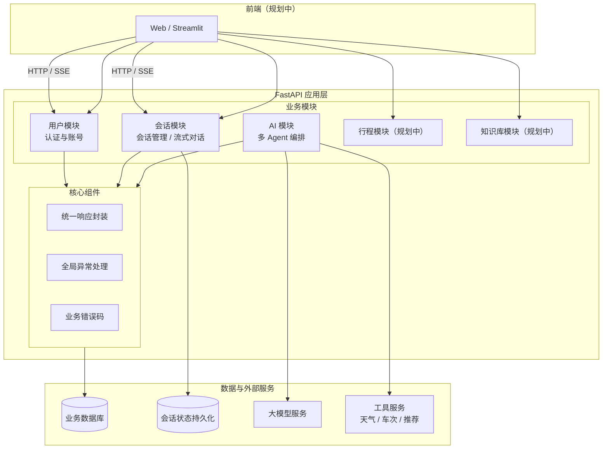
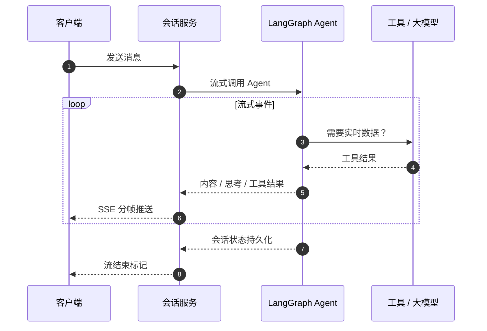
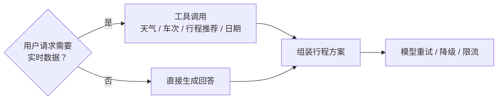
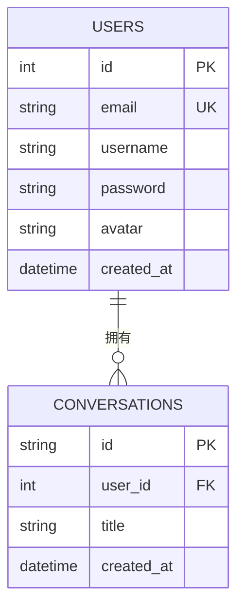
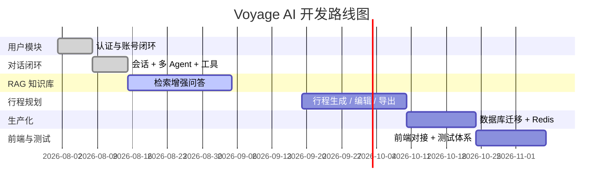

<div align="center">

# 🌏 Voyage AI — 智能旅行规划平台

**基于 FastAPI + SQLAlchemy + LangChain/LangGraph 多 Agent 的 AI 旅行规划后端**

[](https://www.python.org/)
[](https://fastapi.tiangolo.com/)
[](https://www.sqlalchemy.org/)
[](https://www.langchain.com/)
[]()

**当前版本：`v0.1.0`（MVP 阶段）**

</div>

---

## 📌 项目简介

Voyage AI 是一个智能旅行规划平台后端，定位为「旅行专家 + 生活闲聊伙伴」。平台提供完整的用户体系、会话管理与基于多 Agent 协作的流式对话能力，可按需调用天气、车次票价、行程推荐等工具，生成个性化、可核验的出行方案，并通过会话状态持久化实现连续的多轮规划体验。

当前已完成**用户模块与对话闭环**，行程规划与 RAG 知识库处于规划阶段。

---

## 🏗️ 系统架构



---

## ✨ 功能特性

> 标记规则：✅ 已实现 ｜ 🔄 半实现 ｜ ⬜ 未实现

### 👤 用户模块

| 功能 | 状态 |
|------|------|
| ✅ 用户注册（邮箱 + 安全密码哈希） | ✅ |
| ✅ 密码强度校验（注册与改密均生效） | ✅ |
| ✅ 用户登录（JWT 令牌认证） | ✅ |
| ✅ 请求鉴权（受保护接口令牌校验） | ✅ |
| ✅ 个人资料查看与修改（昵称、头像） | ✅ |
| ✅ 修改密码（校验当前密码与新旧一致性） | ✅ |
| ✅ 用户注销（清理会话后删除账号） | ✅ |
| ✅ 可选头像库 | ✅ |
| 🔄 Refresh Token（待接入 Redis） | 🔄 |
| ⬜ 邮箱验证码 / 密码重置 | ⬜ |
| ⬜ 软删除与注销冷却反悔机制 | ⬜ |

### 💬 会话模块

| 功能 | 状态 |
|------|------|
| ✅ 会话创建与列表 | ✅ |
| ✅ 历史消息查询 | ✅ |
| ✅ 会话删除（含批量清理） | ✅ |
| ✅ 会话归属鉴权 | ✅ |
| 🔄 会话状态清理的失败补偿与日志 | 🔄 |

### 🤖 AI 对话模块

| 功能 | 状态 |
|------|------|
| ✅ SSE 流式对话响应 | ✅ |
| ✅ 多 Agent 协作编排 | ✅ |
| ✅ 工具调用（天气、车次、行程推荐等） | ✅ |
| ✅ 模型韧性（重试、降级、限流） | ✅ |
| ✅ 会话状态持久化 | ✅ |
| 🔄 长会话上下文压缩 | 🔄 |

### 🗄️ 基础设施

| 功能 | 状态 |
|------|------|
| ✅ 异步数据库与 ORM 框架 | ✅ |
| ✅ 数据库迁移工具 | ✅ |
| ✅ 统一响应格式与业务错误码 | ✅ |
| ✅ 事务控制 | ✅ |
| 🔄 SQLite → PostgreSQL 迁移 | 🔄 |
| ⬜ Redis（缓存与令牌存储） | ⬜ |
| ⬜ 自动化测试 | ⬜ |

### 🧳 扩展模块

| 功能 | 状态 |
|------|------|
| ⬜ 行程规划（生成 / 编辑 / 导出） | ⬜ |
| ⬜ RAG 知识库（检索增强问答） | ⬜ |
| ⬜ 前端应用 | ⬜ |

---

## 🔍 可视化图表

### AI 对话流式响应



### 多 Agent 协作



### 数据模型



### 开发路线



---

## 🧩 模块说明

| 模块 | 描述 | 状态 |
|------|------|------|
| 用户模块 | 注册、登录、令牌认证、资料、改密、注销 | ✅ 稳定 |
| 会话模块 | 会话管理、流式对话、历史消息、网关 | ✅ 稳定 |
| AI 模块 | 多 Agent 编排、工具调用、模型降级 | ✅ 可用 |
| 业务框架 | 统一响应、错误码、异常处理 | ✅ 稳定 |
| 数据层 | 异步 ORM、事务控制、数据库迁移 | ✅ 稳定 |
| 行程模块 | 行程规划（骨架） | ⬜ 未开始 |
| 知识库模块 | RAG 检索问答（骨架） | ⬜ 未开始 |

---

## 🛠️ 技术栈

| 类别 | 技术 |
|------|------|
| Web 框架 | FastAPI · Uvicorn |
| ORM / 数据库 | SQLAlchemy · SQLite（未来 PostgreSQL） |
| 认证 | Argon2 密码哈希 · JWT 令牌 |
| AI / Agent | LangChain · LangGraph |
| 模型接入 | DeepSeek / Qwen / GLM（多模型降级） |
| 流式传输 | SSE 服务端推送 |
| 工具链 | 天气 · 车次票价 · 行程推荐 · 日期 |
| 前端（规划） | Vue 3 · Element Plus |
| 工程 | uv · 测试框架（规划） |

---

## 📁 项目结构

```
voyage/
├── app/
│   ├── core/          # 框架核心（响应、异常、AI 编排）
│   ├── modules/       # 业务模块（用户 / 会话 / 行程 / 知识库）
│   └── shared/        # 公共组件（数据库、工具）
├── alembic/           # 数据库迁移
├── data/              # 运行时数据
├── tests/             # 测试
└── pyproject.toml     # 项目配置
```

---

## 🚀 快速开始

1. 安装依赖（Python ≥ 3.12 + uv）
2. 配置环境变量（密钥与模型 API Key）
3. 初始化数据库
4. 启动服务
5. 访问接口文档

> 详细步骤见项目文档；AI 对话功能需配置大模型 API Key。

---

## 🗺️ 开发计划

| 阶段 | 内容 | 状态 |
|------|------|------|
| Phase 1 | 用户模块 + 令牌认证 | ✅ 已完成 |
| Phase 2 | 会话管理 + AI 流式对话 | ✅ 已完成 |
| Phase 3 | RAG 知识库 + 向量检索 | 🔄 进行中 |
| Phase 4 | 行程规划 + 导出分享 | ⬜ 待开发 |
| Phase 5 | 数据库迁移 + Redis | ⬜ 待开发 |
| Phase 6 | 前端对接 + 测试体系 | ⬜ 待开发 |

---

<div align="center">

*Voyage AI · v0.1.0 · 持续迭代中*

</div>