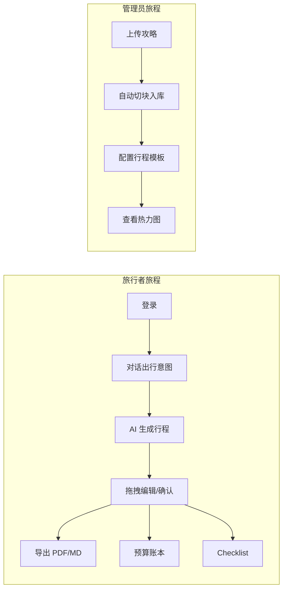
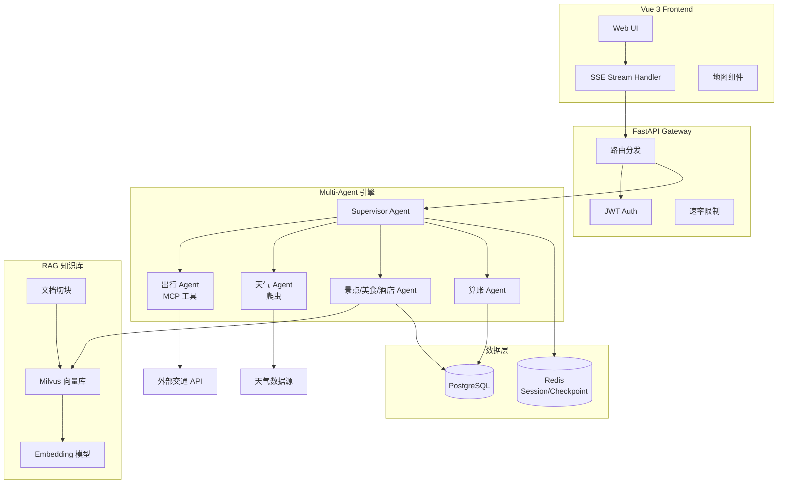
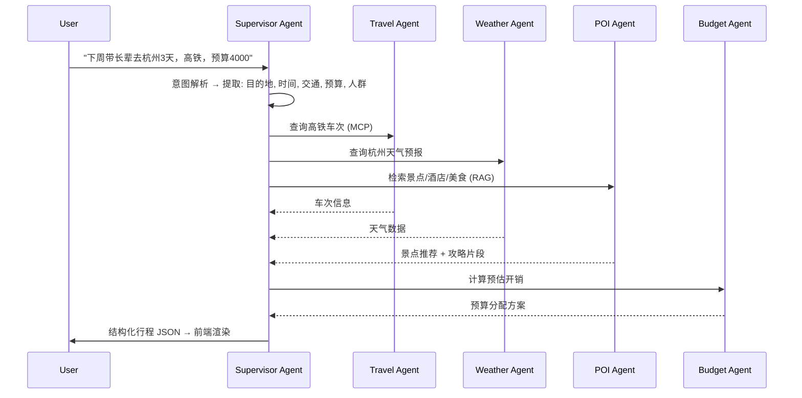
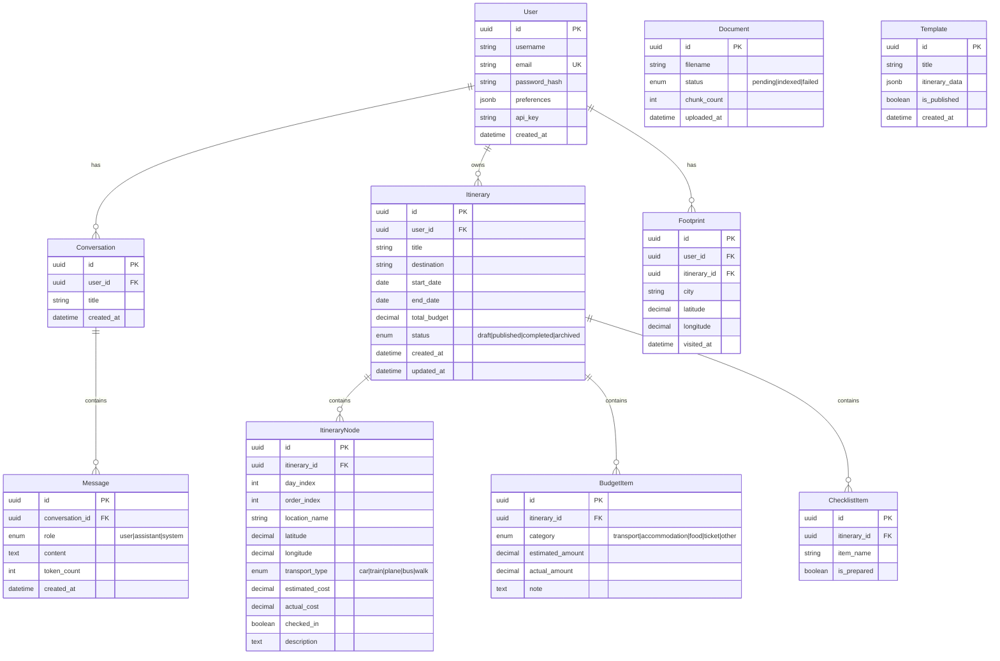
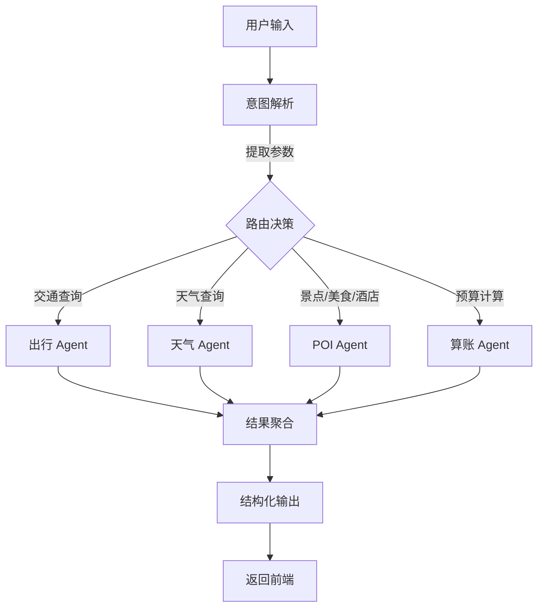
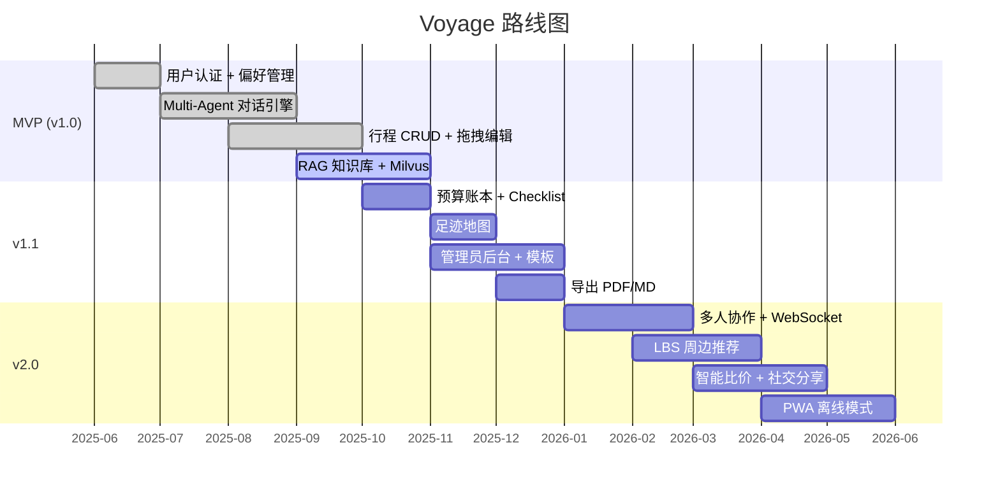

# Voyage — AI 智能旅行规划平台 · 产品需求文档 (PRD)

> **版本：** v1.0  
> **状态：** Draft  
> **技术栈：** Python 3.12 + FastAPI + LangChain + LlamaIndex + PostgreSQL + Redis + Vue 3  
> **定位：** 基于 Multi-Agent + RAG 的全栈智能旅行规划与服务系统

---

## 目录

1. [执行摘要](#1-执行摘要)
2. [用户角色与故事](#2-用户角色与故事)
3. [系统架构](#3-系统架构)
4. [项目脚手架](#4-项目脚手架)
5. [核心功能模块](#5-核心功能模块)
6. [API 接口规范](#6-api-接口规范)
7. [数据库实体关系](#7-数据库实体关系)
8. [AI 系统设计](#8-ai-系统设计)
9. [建议增强功能](#9-建议增强功能)
10. [风险评估与路线图](#10-风险评估与路线图)

---

## 1. 执行摘要

### 问题陈述

旅行规划涉及多维度信息整合（交通、天气、景点、住宿、预算），用户需在多个平台间反复切换，缺乏一站式 AI 驱动的个性化行程编排工具。

### 解决方案

Voyage 通过 **Supervisor Multi-Agent** 架构 + **RAG 知识库**，以自然语言对话为入口，自动完成意图解析、多源信息检索、结构化行程生成与交互编辑。

### 成功指标

| 指标 | 目标 |
|---|---|
| 行程生成成功率 | ≥ 90%（用户采纳 AI 建议） |
| 端到端响应时间 | ≤ 8s（含 Agent 编排） |
| RAG 召回 Precision@10 | ≥ 85% |
| 用户留存率 (D7) | ≥ 40% |

---

## 2. 用户角色与故事

### 角色定义

| 角色 | 描述 | 核心诉求 |
|---|---|---|
| **旅行者 (Traveler)** | 普通用户，有出行规划需求 | 一句话生成行程、在线编辑、预算管理 |
| **资深玩家 (Power User)** | 频繁出行，需要深度攻略 | RAG 路书检索、足迹地图、自定义 API Key |
| **管理员 (Admin)** | 后台运营人员 | 知识库管理、模板发布、数据统计 |

### 用户故事



### 关键用户故事

- **As a** 旅行者, **I want to** 用自然语言描述出行需求, **so that** AI 自动生成结构化行程
- **As a** 旅行者, **I want to** 拖拽调整行程节点, **so that** 灵活适配实际安排
- **As a** 旅行者, **I want to** 查看预算明细与 Checklist, **so that** 行前准备不遗漏
- **As a** 资深玩家, **I want to** 查看个人足迹地图, **so that** 记录走过的所有目的地
- **As a** 管理员, **I want to** 上传攻略 PDF/MD, **so that** RAG 引擎可检索私域知识

---

## 3. 系统架构

### 整体架构图



### Multi-Agent 协作流程



---

## 4. 项目脚手架

```
voyage/
├── pyproject.toml              # 项目元数据与依赖
├── main.py                     # 应用入口
├── .env.example                # 环境变量模板
├── .python-version             # Python 3.12
│
├── app/
│   ├── main.py                 # FastAPI 应用工厂
│   ├── config.py               # Pydantic Settings 配置
│   │
│   ├── api/                    # API 路由层
│   │   ├── __init__.py
│   │   ├── v1/                 # API v1
│   │   │   ├── __init__.py
│   │   │   ├── auth.py         # 认证相关
│   │   │   ├── users.py        # 用户管理
│   │   │   ├── itineraries.py  # 行程 CRUD
│   │   │   ├── chat.py         # 对话 SSE
│   │   │   ├── budgets.py      # 预算接口
│   │   │   ├── checklists.py   # 清单接口
│   │   │   ├── footprints.py   # 足迹接口
│   │   │   ├── rag.py          # 知识库管理
│   │   │   ├── templates.py    # 模板管理
│   │   │   └── admin.py        # 管理后台
│   │   └── deps.py             # 依赖注入 (get_db, get_current_user)
│   │
│   ├── core/                   # 核心业务逻辑
│   │   ├── __init__.py
│   │   ├── agents/             # Multi-Agent 定义
│   │   │   ├── __init__.py
│   │   │   ├── supervisor.py   # Supervisor Agent
│   │   │   ├── travel.py       # 出行 Agent
│   │   │   ├── weather.py      # 天气 Agent
│   │   │   ├── poi.py          # POI Agent
│   │   │   └── budget.py       # 算账 Agent
│   │   ├── tools/              # Agent 工具
│   │   │   ├── __init__.py
│   │   │   ├── mcp_client.py   # MCP 工具客户端
│   │   │   └── web_crawler.py  # 爬虫工具
│   │   ├── skills/             # LangChain 技能
│   │   │   └── __init__.py
│   │   └── rag/                # RAG 引擎
│   │       ├── __init__.py
│   │       ├── ingestion.py    # 文档入库流水线
│   │       ├── retriever.py    # 检索器
│   │       └── chunker.py      # 文档切块策略
│   │
│   ├── db/                     # 数据访问层
│   │   ├── __init__.py
│   │   ├── session.py          # SQLAlchemy async session
│   │   ├── models.py           # ORM 模型定义
│   │   └── migrations/         # Alembic 迁移
│   │       └── ...
│   │
│   └── schemas/                # Pydantic 模型 (请求/响应)
│       ├── __init__.py
│       ├── auth.py
│       ├── user.py
│       ├── itinerary.py
│       ├── chat.py
│       ├── budget.py
│       ├── checklist.py
│       ├── footprint.py
│       └── rag.py
│
├── data/                       # 本地数据目录
│   └── docs/                   # 攻略文档源文件
│
└── tests/                      # 测试套件
    ├── __init__.py
    ├── conftest.py
    ├── test_api/
    ├── test_agents/
    └── test_rag/
```

---

## 5. 核心功能模块

### 5.1 用户认证与基础管理 (Auth & User)

- 邮箱/用户名注册 + 密码登录，JWT 鉴权 (access + refresh token)
- 偏好设置（交通工具、出行风格、特殊需求）→ 长期记忆存入 PostgreSQL
- 短期会话 checkpoint → Redis
- 支持自定义 API Key（供资深玩家直接调用）

### 5.2 AI 多轮对话与行程生成 (Multi-Agent Engine)

- **SSE (Server-Sent Events)** 流式输出，前端逐块渲染
- Supervisor Agent 意图路由：提取时间、地点、人数、预算、交通方式
- 子 Agent 通过 LangChain 的 MCP 协议调用外部工具
- AI 输出结构化 JSON（非纯文本），前端解析为可视化行程看板

### 5.3 行程管理与交互编辑 (Itinerary CRUD)

- 按天数 → 时间段展示行程卡片
- 拖拽排序、节点级增删改
- 导出为 PDF / Markdown

### 5.4 辅助管理模块

| 子模块 | 核心能力 |
|---|---|
| **动态预算账本** | AI 提取预估开销 → 用户手动修正实际花费 |
| **行前 Checklist** | 根据行程特性自动生成（高海拔/露营/海岛） |
| **个人足迹地图** | 归档行程标注在地图上 |
| **知识库管理** | 上传 MD/PDF，自动切块 → Milvus 向量库 |
| **模板管理** | 管理员发布经典行程模板 |
| **数据统计** | 热门目的地热力图 |

---

## 6. API 接口规范

> 遵循 RESTful 规范：资源名词复数、kebab-case、正确 HTTP 语义、统一响应信封。

### 通用约定

| 项目 | 标准 |
|---|---|
| 基础路径 | `/api/v1` |
| 响应信封 | `{ "data": ..., "meta": ..., "links": ... }` / `{ "error": { "code", "message", "details" } }` |
| 分页 | 偏移分页 `?page=1&per_page=20`，返回 `meta.total / meta.page / meta.per_page` |
| 鉴权 | `Authorization: Bearer <JWT>` |
| 速率限制 | 已认证 100/min，匿名 30/min |

### 6.1 认证

```
POST   /api/v1/auth/register      # 注册
POST   /api/v1/auth/login         # 登录 → 返回 access_token, refresh_token
POST   /api/v1/auth/refresh       # 刷新 token
POST   /api/v1/auth/logout        # 登出（失效 token）
```

### 6.2 用户

```
GET    /api/v1/users/me            # 获取当前用户信息
PATCH  /api/v1/users/me            # 更新偏好设置
PUT    /api/v1/users/me/api-key    # 更新自定义 API Key
```

### 6.3 对话 (SSE)

```
POST   /api/v1/chat/sessions                    # 创建新会话
GET    /api/v1/chat/sessions                     # 获取会话列表
GET    /api/v1/chat/sessions/:id                 # 获取会话历史
DELETE /api/v1/chat/sessions/:id                 # 删除会话
POST   /api/v1/chat/sessions/:id/messages        # 发送消息（SSE 流式返回）
```

**消息响应格式 (SSE):**

```
event: token
data: {"type": "token", "content": "推荐"}

event: token
data: {"type": "token", "content": "您乘坐"}

event: structured
data: {"type": "itinerary", "data": { "days": [...] }}

event: done
data: {"type": "done", "session_id": "abc-123"}
```

### 6.4 行程

```
GET    /api/v1/itineraries                        # 行程列表（分页）
POST   /api/v1/itineraries                        # 创建行程（手动）
GET    /api/v1/itineraries/:id                     # 行程详情（含节点）
PATCH  /api/v1/itineraries/:id                     # 更新行程元信息
DELETE /api/v1/itineraries/:id                     # 删除行程
POST   /api/v1/itineraries/:id/duplicate           # 复制行程

# 行程节点
POST   /api/v1/itineraries/:id/nodes              # 新增节点
PATCH  /api/v1/itineraries/:id/nodes/:nid         # 编辑节点
DELETE /api/v1/itineraries/:id/nodes/:nid         # 删除节点
PUT    /api/v1/itineraries/:id/nodes/reorder      # 拖拽排序（批量更新 order_index）

# 导出
GET    /api/v1/itineraries/:id/export?format=pdf|md
```

### 6.5 预算

```
GET    /api/v1/itineraries/:id/budget-items        # 获取预算明细
POST   /api/v1/itineraries/:id/budget-items        # 新增预算项
PATCH  /api/v1/itineraries/:id/budget-items/:bid   # 修改（可更新实际金额）
DELETE /api/v1/itineraries/:id/budget-items/:bid   # 删除
```

### 6.6 Checklist

```
GET    /api/v1/itineraries/:id/checklist           # 获取清单
POST   /api/v1/itineraries/:id/checklist           # 新增清单项
PATCH  /api/v1/itineraries/:id/checklist/:cid      # 切换勾选状态 / 修改
DELETE /api/v1/itineraries/:id/checklist/:cid      # 删除
```

### 6.7 足迹

```
GET    /api/v1/footprints                          # 获取用户所有足迹点
GET    /api/v1/footprints/stats                    # 足迹统计（国家/城市计数）
```

### 6.8 知识库管理 (Admin)

```
POST   /api/v1/admin/documents/upload              # 上传文档（MD/PDF）
GET    /api/v1/admin/documents                      # 文档列表
DELETE /api/v1/admin/documents/:id                  # 删除文档
POST   /api/v1/admin/documents/:id/reindex          # 重新切块入库
```

### 6.9 模板管理 (Admin)

```
GET    /api/v1/admin/templates                      # 模板列表
POST   /api/v1/admin/templates                      # 创建模板
PATCH  /api/v1/admin/templates/:id                  # 编辑
DELETE /api/v1/admin/templates/:id                  # 删除
PUT    /api/v1/admin/templates/:id/publish          # 发布/下架
```

### 6.10 统计数据 (Admin)

```
GET    /api/v1/admin/stats/overview                 # 大盘概览
GET    /api/v1/admin/stats/destinations             # 热门目的地排行
GET    /api/v1/admin/stats/daily-active             # DAU 趋势
```

---

## 7. 数据库实体关系



---

## 8. AI 系统设计

### 8.1 Supervisor Agent 决策流程



### 8.2 RAG 策略

| 阶段 | 技术选型 |
|---|---|
| **文档切块** | LlamaIndex `SentenceSplitter`，chunk_size=512，overlap=128 |
| **嵌入模型** | `text-embedding-3-small` (OpenAI) 或开源 BGE |
| **向量库** | Milvus（自托管） |
| **检索策略** | Hybrid Search (dense + sparse) + reranker |
| **召回范围** | top_k=5，按行程目的地 + 风格过滤 |

### 8.3 评估策略

| 维度 | 方法 | 目标 |
|---|---|---|
| 意图提取准确率 | 标注 200 条对话，对比提取字段 | ≥ 95% |
| 行程合理性 | 人工评分 (1-5) 路线逻辑/时间衔接 | ≥ 4.0 |
| RAG 相关性 | Precision@5, NDCG@5 | ≥ 85% |
| 端到端延迟 | 压测 50 并发请求 P95 | ≤ 8s |

---

## 9. 建议增强功能

### 9.1 新增功能

| 功能 | 说明 | 优先级 |
|---|---|---|
| **多人协作行程** | 分享行程链接，多人实时编辑（WebSocket + CRDT） | P2 |
| **LBS 周边推荐** | 基于行程节点经纬度，实时推荐附近景点/餐厅 | P2 |
| **AI 行程语音播报** | TTS 朗读每日行程安排 | P3 |
| **智能比价** | 同一路线的高铁/飞机/自驾费用横向对比 | P2 |
| **社交分享卡片** | 行程导出为精美社交图片（OG Image 风格） | P3 |
| **离线模式** | PWA 支持，离线查看已保存行程 | P3 |
| **行程冲突检测** | 时间/地点重叠自动告警 | P1 |

### 9.2 新增 API 建议

```
# 多人协作
POST   /api/v1/itineraries/:id/collaborators        # 添加协作者
DELETE /api/v1/itineraries/:id/collaborators/:uid    # 移除协作者
GET    /api/v1/itineraries/:id/collaborators         # 协作者列表
WS     /ws/itineraries/:id                           # 实时协作 sync

# LBS 周边
GET    /api/v1/nearby?lat=...&lng=...&radius=1000   # 周边 POI

# 比价
POST   /api/v1/compare-routes                        # 多交通方式比价

# 社交
POST   /api/v1/itineraries/:id/share-card            # 生成分享卡片
```

### 9.3 技术改进建议

- **缓存策略**：热门目的地模板 / 天气数据 Redis 缓存 30min，减少 Agent 调用
- **异步任务**：PDF 导出、文档入库用 Celery / ARQ 异步队列
- **监控**：Agent 调用链路追踪 (OpenTelemetry)，LLM token 消耗计量
- **多模型支持**：Supervisor 用 GPT-4，子 Agent 用 GPT-4o-mini 降本

---

## 10. 风险评估与路线图

### 技术风险

| 风险 | 影响 | 缓解措施 |
|---|---|---|
| Agent 编排延迟 | 用户体验下降 | 子 Agent 并行调用 + SSE 流式输出 |
| LLM Token 成本 | 运营成本超支 | 子 Agent 用低成本模型，缓存重复查询 |
| RAG 召回质量 | 推荐不准确 | Hybrid Search + reranker + 人工标注反馈 |
| 外部 API 不稳定 | 行程生成失败 | 降级策略（缓存结果 + 提示用户手动输入） |

### 分阶段路线图



---

> **下一步：** 根据此 PRD 生成完整的 OpenAPI (Swagger) 规范文件，以及 Alembic 数据库迁移脚本。