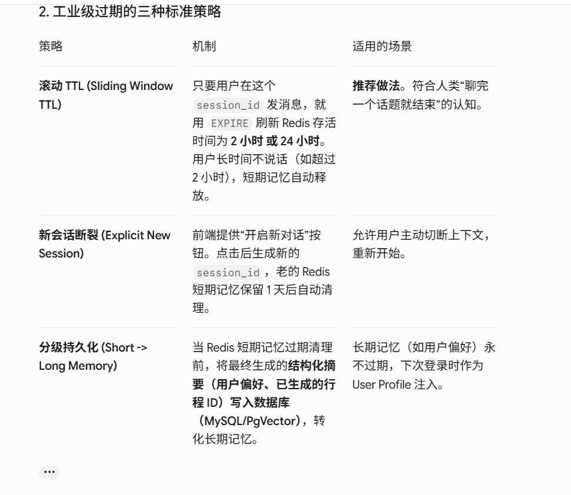

# Voyage Agent 短期会话记忆（Short-Term Memory）演进路线图

## 1. 架构设计理念与技术选型

在大模型 Agent 体系中，短期记忆（Short-Term Memory）用于维系**单次连续会话的上下文（Session Context）**，解决多轮追问、指代消解与槽位填充问题。


- **存储介质**：Redis（毫秒级读写、内置 TTL 自动过期、天然支持列表与向量索引）。
- **演进策略**：从**极简列表滑动窗口**开始，渐进式过渡到**摘要压缩（Summary Memory）**，最终通过 **Redis Stack (`redisvl`)** 实现**语义缓存与持久化检索**。

## 2. 第一阶段：极简滑动窗口记忆（MVP 快速落地）

### 2.1 架构设计

- **存储结构**：Redis `List`
- **Key 命名规范**：`voyage:chat:memory:{session_id}`
- **控制策略**：使用 `RPUSH` 追加消息，使用 `LTRIM` 保持窗口大小（如固定保留最近 10 条/5 轮对话），使用 `EXPIRE` 设置 2 小时滚动 TTL。

### 2.2 核心逻辑实现

Plaintext

```
[User Request] ──> [RPUSH 存用户消息] ──> [LTRIM 截断窗口] ──> [调用 LLM] ──> [RPUSH 存 AI 响应] ──> [EXPIRE 刷新 TTL]
```

## 3. 第二阶段：摘要压缩记忆（Summary + Buffer 机制）

### 3.1 核心痛点

纯硬截断（Truncation）会导致早期关键信息（如“用户预算 3000 元”、“偏好自驾”）丢失，导致 LLM 在多轮对话后期出现上下文断层。


### 3.2 组合架构设计

- **双 Key 存储**：
  - `voyage:chat:summary:{session_id}`（类型：`String`）：存放过去对话被压缩后的摘要。
  - `voyage:chat:messages:{session_id}`（类型：`List`）：仅存放最近 $N$ 条（如 6 条）原始对话片段。
- **总结触发器（Summary Middleware）**：当 `List` 长度超过阈值（如 > 10 条）时，后台异步调用轻量级 LLM（如 `qwen-flash`）将早期消息增量归纳并更新至 `summary`，随后对 `List` 执行裁剪。

### 3.3 拼装给 LLM 的上下文结构

JSON

```
[
  {"role": "system", "content": "历史背景摘要：{summary_text}"},
  {"role": "user", "content": "最新消息 1"},
  {"role": "assistant", "content": "最新消息 2"},
  {"role": "user", "content": "当前消息"}
]
```

## 4. 第三阶段：基于 redisvl 的语义级增强（高级演进）

### 4.1 引入 Redis Stack & redisvl

将 Redis 升级为 `redis/redis-stack-server` 镜像，利用 `redisvl` 客户端库实现结构化存储与向量检索能力。

```python
from redisvl.index import SearchIndex

# 1. 声明式定义向量索引 Schema
schema = {
    "index": {"name": "travel_knowledge", "prefix": "doc"},
    "fields": [
        {"name": "content", "type": "text"},
        {"name": "embedding", "type": "vector", "attrs": {"dims": 1536, "algorithm": "hnsw", "distance_metric": "cosine"}}
    ]
}

# 2. 快速创建与检索
index = SearchIndex.from_dict(schema)
index.connect("redis://localhost:6379")
index.create(overwrite=True)
```

**`ChatMessageStoreProtocol`** 是主流 Agent 框架（特别是 **LlamaIndex**）中定义的**协议/接口抽象规范（Protocol / Abstract Interface）**。

#### 核心作用

在 LlamaIndex 中，为了避免将对话历史强绑定在某种特定的存储介质上，官方抽象出了 `ChatMessageStoreProtocol`（或 `BaseChatMessageStore`）。它定义了一个合格的“对话历史存储器”**必须具备哪些标准方法**（如添加消息、读取消息、删除消息等）。

#### 标准规范结构

不管底层用的是 Redis、PostgreSQL、MongoDB 还是内存 List，只要实现了该 Protocol 规定的几个方法，就可以作为 Agent 的对话记忆模块接入系统：

```python
# Protocol 规定的核心行为（伪代码示意）
class ChatMessageStoreProtocol(Protocol):
    def get_messages(self, session_id: str) -> list[ChatMessage]:
        """获取指定会话的历史消息"""
        ...
        
    def add_message(self, session_id: str, message: ChatMessage) -> None:
        """追加一条新消息"""
        ...
        
    def delete_messages(self, session_id: str) -> None:
        """清空会话历史"""
        ...
```

```python
# app/modules/conversations/service.py
from app.core.memory import ShortTermMemory
from app.core.llm import get_llm, VoyageModel

class ConversationService:
    async def process_message(self, message: str, session_id: str):
        # 1. 实例化当前 Session 的短期记忆
        memory = ShortTermMemory(session_id=session_id)
        
        # 2. 拉取历史短期记忆
        history = await memory.get_messages()
        
        # 3. 组装发给 LLM 的完整 messages 上下文
        messages = [
            {"role": "system", "content": "你是一名专业的 Voyager 旅行规划 AI 助手。"}
        ]
        messages.extend(history)
        messages.append({"role": "user", "content": message})

        # 4. 写入用户本次发送的消息到 Redis
        await memory.add_message(role="user", content=message)

        # 5. 调用 LLM 获得流式响应
        llm = get_llm(model=VoyageModel.QWEN_3_5_FLASH, temperature=0.7)
        full_response = []
        
        async for chunk in llm.astream(messages):
            content = chunk.content
            full_response.append(content)
            yield content

        # 6. 生成完毕后，把 AI 的完整回答也写入 Redis 短期记忆
        await memory.add_message(role="assistant", content="".join(full_response))
```


### 4.2 语义缓存（Semantic Caching）

- **原理**：基于向量相似度计算（Cosine Similarity），对用户高频重复提问（如“杭州 3 天自驾怎么玩”）进行语义拦截。
- **效果**：命中缓存直接返回响应，降低 API 响应延时并节省 Token 开销。

### 4.3 记忆检索与 LlamaIndex 无缝接入

利用 `redisvl` 声明式索引（Schema Definition），将 Session 记忆转化为可检索的 Vector Memory。即使短期记忆过期，Agent 也能基于语义向量检索历史偏好。


## 5. 生命周期管理与长短期记忆衔接



在你的 **Voyage** 系统中：

1. **短期记忆（Redis）：** 存 **“最新 6 条原始消息 + 旧消息的 Summary 摘要”**，设置 **`TTL = 2 小时`**（每次发消息重置）。
2. **长期记忆（MySQL/PostgreSQL）：** 用户每次对话生成的完整记录持久化保存，用于前端展示历史列表。
3. **记忆桥接：** 当用户时隔几天开启**新会话**时，短期记忆为空，但系统从**长期数据库**中提取用户画象（如“该用户偏好自驾”），直接作为全局 System Prompt 传入，实现完美的体验闭环！


---

## 6. 项目现状断层分析（截至 2026-08）

以下分析基于 `voyage/app/` 实际代码：

```
voyage/app/
├── config.py              # ❌ 缺 REDIS_URL 字段
├── core/
│   ├── memory.py          # ❌ memory.py#L9 引用 config.REDIS_URL，但 config 中未定义
│   ├── llm.py             # ✅ 可用
│   └── supervisor.py      # ❌ 调用时无历史消息注入
├── modules/chat/
│   ├── service.py         # ❌ 未接入任何记忆逻辑，直接转发到 factory
│   ├── factory.py         # ❌ 未拼接 history messages
│   ├── router.py          # ⚠️ 收到 session_id 但未传递给记忆层
│   └── schemas.py         # ✅ session_id 已有、默认生成
├── .env                   # ❌ 无 REDIS_URL 配置
└── pyproject.toml         # ✅ redis>=8.1.0 依赖已声明
```

**核心断裂点**：
- `app/core/memory.py:9` 写了 `config.REDIS_URL`，但 `app/config.py` 中无此字段、`.env` 中无此值——代码直接报错不可用。
- `app/modules/chat/service.py` 和 `factory.py` 均未拉取/注入历史消息，每轮对话独立无上下文。

## 7. Phase 1 详细实施步骤（极简滑动窗口）

### 7.1 补全 Config

**`app/config.py`** 新增字段：

```python
class VoyageConfig(BaseSettings):
    # ... 现有字段不动 ...
    REDIS_URL: str = "redis://localhost:6379/0"  # 新增，带默认值

    # --- Memory 相关配置（Phase2/3也用） ---
    MEMORY_MODE: str = "sliding"                 # sliding | summary | semantic
    MEMORY_WINDOW_SIZE: int = 10                 # 窗口大小
    MEMORY_TTL: int = 7200                       # 2小时
    MEMORY_SUMMARY_MODEL: str = "qwen3.5-flash"  # 摘要用轻量模型
```

**`.env`** 新增：

```env
REDIS_URL=redis://localhost:6379/0
MEMORY_MODE=sliding
MEMORY_WINDOW_SIZE=10
MEMORY_TTL=7200
```

### 7.2 修复 memory.py

已有滑动窗口实现基本正确，只需验证配置贯通、调整 TTL：

```python
# app/core/memory.py（修正后片段）
redis_client = Redis.from_url(config.REDIS_URL, decode_responses=True)

class RedisShortTermMemory:
    def __init__(self, session_id: str, window_size: int = 10, ttl: int = 7200):
        self.session_id = f"voyage:chat:memory:{session_id}"
        self.window_size = window_size  # 窗口保持 10 条
        self.ttl = ttl                  # ⚠️ 改为 7200（文档统一 2h）
```

### 7.3 改造 service.py — 记忆接入管线

```python
# app/modules/chat/service.py
from app.core.memory import RedisShortTermMemory
from app.modules.chat.factory import astream_chat

class ChatService:
    async def process_message(self, message: str, session_id: str):
        memory = RedisShortTermMemory(session_id=session_id)
        history = await memory.get_messages()
        await memory.add_message(role="user", content=message)

        buffer = []
        async for chunk in astream_chat(message, history=history):
            buffer.append(chunk)
            yield chunk

        full_reply = "".join(buffer)
        await memory.add_message(role="assistant", content=full_reply)
```

### 7.4 改造 factory.py — 历史拼接

```python
# app/modules/chat/factory.py
from langchain.messages import HumanMessage, SystemMessage, AIMessage

async def astream_chat(message: str, history: list[dict] | None = None):
    system = SystemMessage(content="你是一名专业的 Voyager 旅行规划 AI 助手。")
    msgs = [system]
    if history:
        for h in history:
            if h["role"] == "user":
                msgs.append(HumanMessage(content=h["content"]))
            else:
                msgs.append(AIMessage(content=h["content"]))
    msgs.append(HumanMessage(content=message))

    stream = supervisor_agent.astream({"messages": msgs}, stream_mode="messages")
    async for event in stream:
        if not (isinstance(event, tuple) and event):
            continue
        chunk = getattr(event[0], "content", None)
        if isinstance(chunk, str) and chunk:
            yield chunk
```

### 7.5 Phase 1 完整数据流

```
User POST /api/v1/chat/completions {message, session_id}
  → ChatRouter
    → ChatService.process_message(message, session_id)
      → RedisShortTermMemory(session_id)
        → get_messages()               # 读历史
        → add_message("user", ...)     # 存用户消息
      → astream_chat(message, history) # 带上下文调 LLM
      → [SSE 逐 token 返给客户端]
      → add_message("assistant", ...)  # 存 AI 完整响应
```

## 8. Phase 2 详细实施步骤（摘要压缩记忆）

### 8.1 新增 SummaryMemory 模块

```python
# app/core/summary_memory.py
import json, asyncio
from redis.asyncio import Redis
from app.config import config
from app.core.llm import get_llm, VoyageModel

redis_client = Redis.from_url(config.REDIS_URL, decode_responses=True)

class SummaryMemory:
    """双Key：summary String + recent messages List"""

    def __init__(self, session_id: str, max_recent: int = 6, ttl: int = 7200):
        self.summary_key = f"voyage:chat:summary:{session_id}"
        self.messages_key = f"voyage:chat:messages:{session_id}"
        self.max_recent = max_recent
        self.ttl = ttl

    async def add_message(self, role: str, content: str):
        msg = json.dumps({"role": role, "content": content}, ensure_ascii=False)
        await redis_client.rpush(self.messages_key, msg)
        await redis_client.ltrim(self.messages_key, -self.max_recent, -1)
        await redis_client.expire(self.messages_key, self.ttl)

    async def get_context(self) -> list[dict]:
        summary = await redis_client.get(self.summary_key)
        raw = await redis_client.lrange(self.messages_key, 0, -1)
        recent = [json.loads(m) for m in raw]
        context = []
        if summary:
            context.append({"role": "system", "content": f"历史背景摘要：{summary}"})
        context.extend(recent)
        return context

    async def trigger_summarize(self, early_messages: list[dict]):
        if len(early_messages) < 2:
            return
        prompt = f"将以下对话浓缩为中文摘要，保留关键信息（预算、偏好、决定）：\n{json.dumps(early_messages, ensure_ascii=False)}"
        llm = get_llm(model=config.MEMORY_SUMMARY_MODEL, temperature=0.3)
        summary = await llm.ainvoke(prompt)
        await redis_client.set(self.summary_key, summary.content, ex=self.ttl)
```

### 8.2 Service 升级（策略可切换）

```python
# app/modules/chat/service.py（Phase2 升级版）
class ChatService:
    async def process_message(self, message: str, session_id: str):
        if config.MEMORY_MODE == "summary":
            memory = SummaryMemory(session_id=session_id)
            context = await memory.get_context()
            await memory.add_message(role="user", content=message)
        else:
            memory = RedisShortTermMemory(session_id=session_id)
            context = await memory.get_messages()
            await memory.add_message(role="user", content=message)

        buffer = []
        async for chunk in astream_chat(message, history=context):
            buffer.append(chunk)
            yield chunk

        full_reply = "".join(buffer)
        await memory.add_message(role="assistant", content=full_reply)

        # Phase2：后台触发摘要（不阻塞 SSE 流）
        if config.MEMORY_MODE == "summary":
            early = [{"role": "user", "content": message}, {"role": "assistant", "content": full_reply}]
            asyncio.create_task(memory.trigger_summarize(early))
```

## 9. Phase 3 详细实施步骤（RedisVL 语义增强）

https://zhuanlan.zhihu.com/p/2002684207500124375

### 9.1 基础设施变更

| 变更项 | 操作 |
|--------|------|
| Redis 镜像 | `redis` → `redis/redis-stack-server`（支持向量模块） |
| 新增依赖 | `redisvl>=0.5.0` |
| Docker Compose | 新增 Redis Stack 服务定义 |

### 9.2 语义缓存实现

```python
# app/core/semantic_cache.py
from redisvl.index import SearchIndex

CACHE_SCHEMA = {
    "index": {"name": "voyage_cache", "prefix": "cache"},
    "fields": [
        {"name": "question", "type": "text"},
        {"name": "answer", "type": "text"},
        {"name": "embedding", "type": "vector", "attrs": {"dims": 1536, "algorithm": "hnsw", "distance_metric": "cosine"}}
    ]
}

class SemanticCache:
    def __init__(self):
        self.index = SearchIndex.from_dict(CACHE_SCHEMA)
        self.index.connect(str(config.REDIS_URL))
        self.index.create(overwrite=False)

    async def lookup(self, question_embedding: list[float], threshold: float = 0.92):
        results = self.index.query(vector=question_embedding, top_k=1, return_fields=["answer"])
        if results and results[0].distance >= threshold:
            return results[0].answer
        return None

    async def store(self, question: str, answer: str, embedding: list[float]):
        self.index.load([{"question": question, "answer": answer, "embedding": embedding}])
```

### 9.3 LlamaIndex Protocol 接入

```python
# app/core/llama_index_adapter.py
from llama_index.core.storage.chat_store import BaseChatStore

class RedisChatStore(BaseChatStore):
    def __init__(self, mode: str = "sliding"):
        self.mode = mode

    def get_messages(self, key: str) -> list[dict]:
        mem = SummaryMemory(key) if self.mode == "summary" else RedisShortTermMemory(key)
        return await (mem.get_context() if self.mode == "summary" else mem.get_messages())

    def add_message(self, key: str, message: dict):
        mem = SummaryMemory(key) if self.mode == "summary" else RedisShortTermMemory(key)
        await mem.add_message(message["role"], message["content"])

    def delete_messages(self, key: str):
        redis_client.delete(f"voyage:chat:memory:{key}")
```

## 10. 风险对照表

| 风险 | 影响 | 缓解措施 |
|------|------|----------|
| Redis 未安装/未启动 | 全部 Phase 不可用 | REDIS_URL 设默认值，应用启动时 health check；不可用时降级为内存 List（兜底） |
| 摘要 LLM 增加延迟 | Phase2 用户体验下降 | trigger_summarize 用 `asyncio.create_task` 异步执行，不阻塞 SSE 响应流 |
| session_id 冲突 | 对话历史错乱 | 已由 generate_uid_sessid 的 `sess_` 前缀 + uid 保证唯一性，无需额外处理 |
| redisvl 版本兼容 | Phase3 索引创建失败 | 锁定 `redisvl>=0.5.0,<0.6.0` + `redis-stack-server>=7.4.0` |
| Phase3 Embedding API 依赖 | 语义缓存/检索不可用 | 复用已有 `config.TEXT_EMBEDDING_MODEL`（text-embedding-v1），无需新增模型 |

## 11. 执行路线图（TL;DR）

```
当前状态（代码断裂、无记忆）
  │
  ├── Phase 1（1-2天）
  │   ├─ Step 1: config.py 加 REDIS_URL 字段
  │   ├─ Step 2: .env 加 REDIS_URL 配置
  │   ├─ Step 3: 确认 memory.py TTL=7200
  │   ├─ Step 4: 改造 service.py 接入 memory
  │   └─ Step 5: 改造 factory.py 拼接历史 + AIMessage
  │
  ├── Phase 2（3-5天）
  │   ├─ Step 1: 新增 app/core/summary_memory.py
  │   ├─ Step 2: service.py 升级为策略可切换
  │   ├─ Step 3: 异步摘要触发器
  │   └─ Step 4: 集成测试（长对话摘要正确性）
  │
  └── Phase 3（1-2周）
      ├─ Step 1: 升级 Redis 镜像 + 安装 redisvl
      ├─ Step 2: 语义缓存模块
      ├─ Step 3: ChatMessageStoreProtocol 适配
      ├─ Step 4: 记忆桥接（过期 Session 向量检索重建上下文）
      └─ Step 5: 端到端压力测试
```

**验证方法**：
- Phase1: 发送 6 轮对话，Redis 中确认仅保留 10 条，TTL 刷新
- Phase2: 发送 8+ 轮后确认 summary key 存在、内容可读
- Phase3: 发送相同语义问题，确认缓存命中、响应时间 < 500ms
